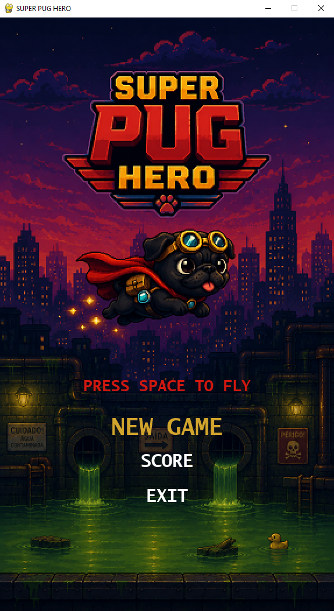

# 🐶 Super Pug Hero

A 2D side-scrolling game developed in Python using Pygame.

## Features

- Main Menu
- Animated Background
- Moving Pipes
- Collectible Bones
- SQLite Score System
- Victory Screen
- Game Over Screen
- Object-Oriented Programming

## Technologies

- Python 3
- Pygame
- SQLite

## Screenshots




## Installation

```bash
pip install -r requirements.txt
python main.py